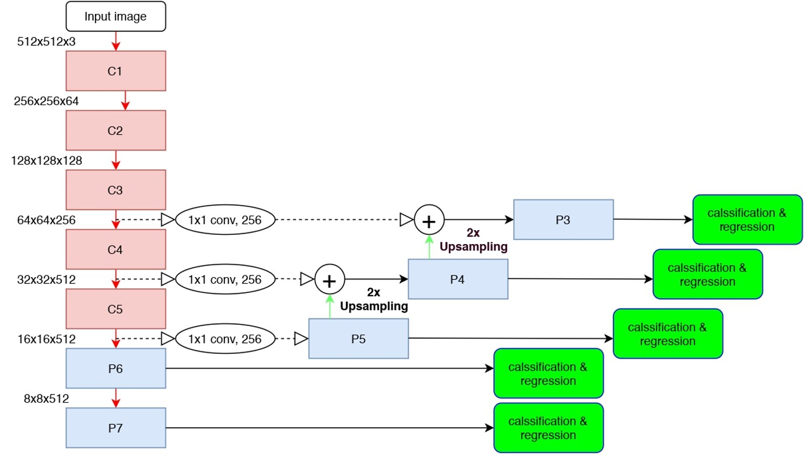
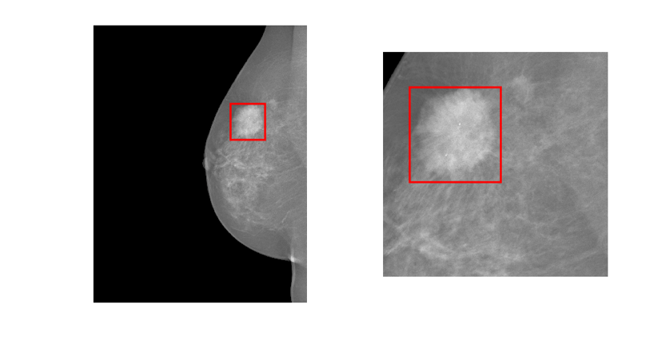
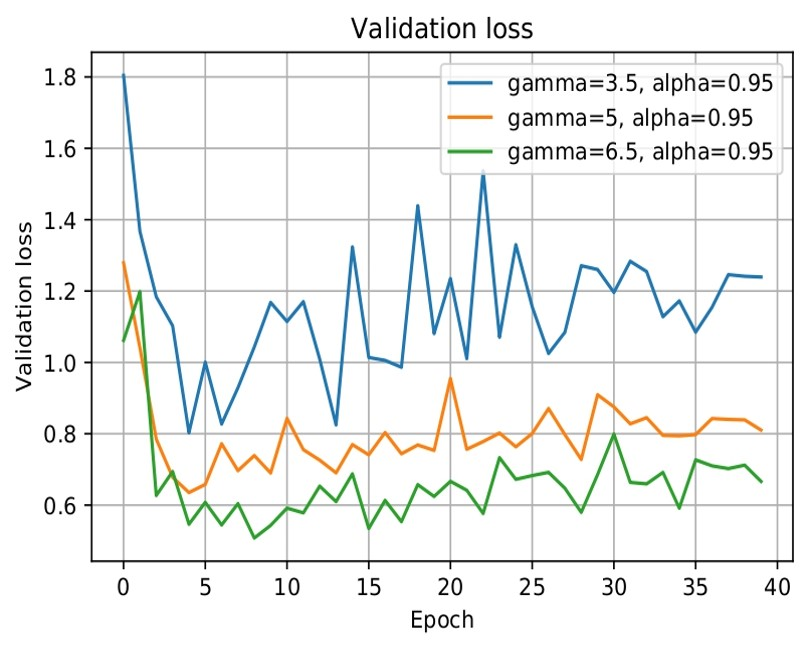
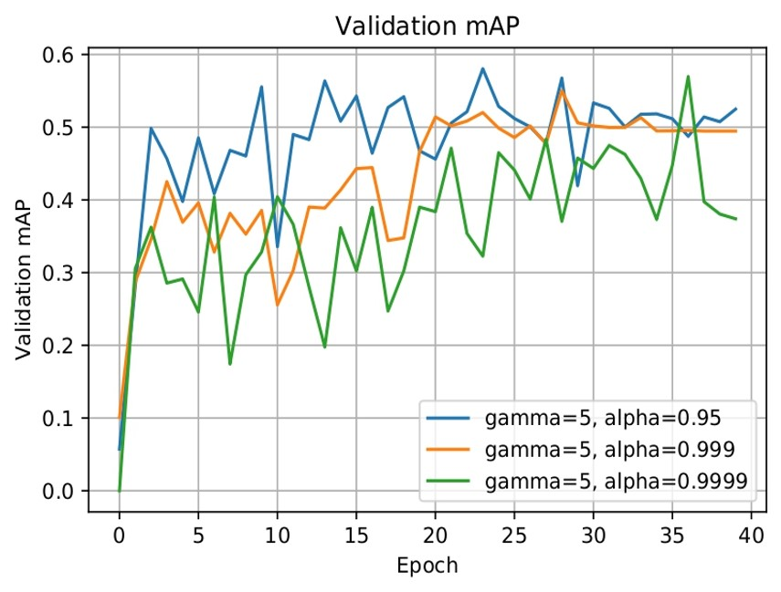
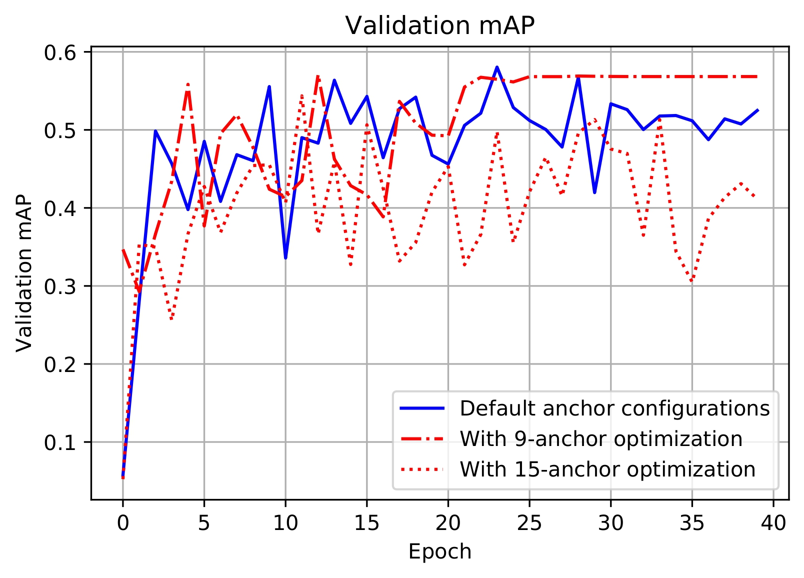
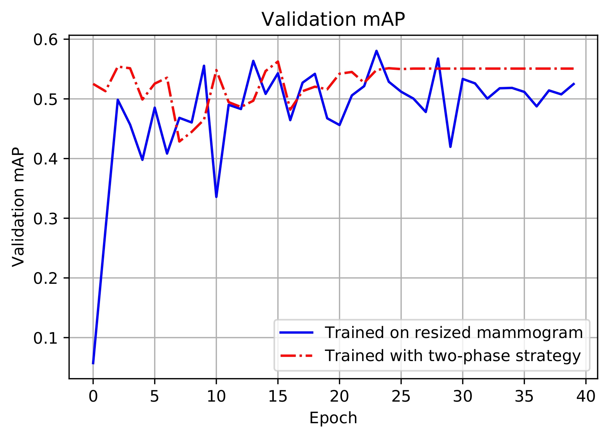
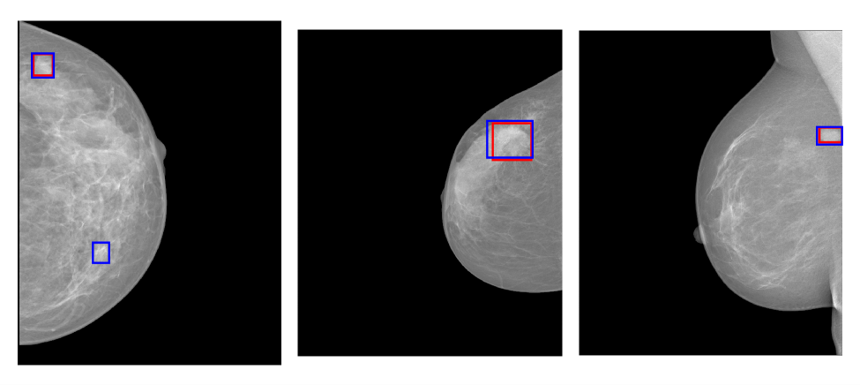
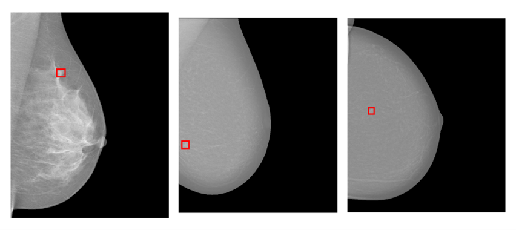

# MSc-RetinaNet-project
 Part of the codes for my M.Sc. project "*RetinaNet for Lesion Detection in Medical Images*", the model that I used can be found in this [repo](https://github.com/fizyr/keras-retinanet) (keras implementation).
## Aim and objectives
- Apply RetinaNet to [INbreast](https://www.sciencedirect.com/science/article/abs/pii/S107663321100451X) dataset to perform lesion detection task (focus on mass), check its applicability and robustness.
- Make modifications to the default setting of some parameters of the network, compare and analyze corresponding results.
- Speed up the training process via adjusting or proposing...
  - [focal loss](https://openaccess.thecvf.com/content_iccv_2017/html/Lin_Focal_Loss_for_ICCV_2017_paper.html) parameters
  - anchor configurations
  - backbone networks
  - splitting ratio in the training dataset
  - training strategy...

##  RetinaNet architecture

 

 Fig. 1: Architecture of the RetinaNet.

## Some pre-processing
- Duplicate the one-channel gray-scale mammogram into three channels to mimic a colored image, and feed into the model.
- Normalize the input mammogram as
  $$M_{out} = \frac{M_{in}-\mu}{\sigma}$$
  where $\mu$ and $\sigma$ are the `mean` and `standard deviation` of the mammograms' pixel value in the training dataset.
> Note: When calculating the values of $\mu$ and $\sigma$, the pixels of the black background on the mammogram, which have values of `0`, are ignored. This is due to the reason that on a mammogram, the area deserves our attention is the body tissue part, not the background. At the same time, most of the time, black background would take up more than half the space of a mammogram, the calculated statistical representation of the mammogram will be biased if the background information is counted.

## Two-stage training strategy
Due to the large size of the mammogram, in the training stage, for each epoch, the GPU memory is only able to hold one single training mammogram, this makes it difficult to stabilize the trained mean and trained variance in the batch normalization layer.

- Method 1: Resize the input mammogram:
  - Fail to exploit the high resolution provided by medical images in the INbreast dataset.
  - Comparably bad performance.
- Method 2: Two-phase training strategy:
  - Phase 1: Pre-train the model on image patches (cropped mammogram).
  - Phase 2: Fine-tune the model on full-size mammograms (freeze the backbone network).

## Image patches (used for pre-training)
Cropped each positive sample (mammogram containing mass) five times, each negative sample two times. When the positive sample is cropped, it is guaranteed that the cropped patch will contain the complete mass, not only a portion of the mass. All the resulting image patches are of size `1024*1024` $\text{pixel}^2$.

 

 Fig. 2: One mammogram and one corresponding patch cropped from it.

## Some training history results
### Tuning hyperparameters of focal loss

  

 Fig. 3: Training history with different focal loss parameters settings.

### Anchor optimization and two-stage training strategy
Also use the anchor optimization introduced in this [repo](https://github.com/martinzlocha/anchor-optimization).

  

 Fig. 4: Training history with anchor optimization (left) and two-stage training strategy (right).

Both anchor optimization and two-stage training strategy can produce more stable converged results.
 
## Some inference results visualization

  

 Fig. 5: Visualization of some good inference results, where red and blue colors are used to indicate ground truth and predicted bounding boxes.

 

 Fig. 6: Visualization of some bad inference results, it can be witnessed that no predictions are returned by the trained model.

 

 

